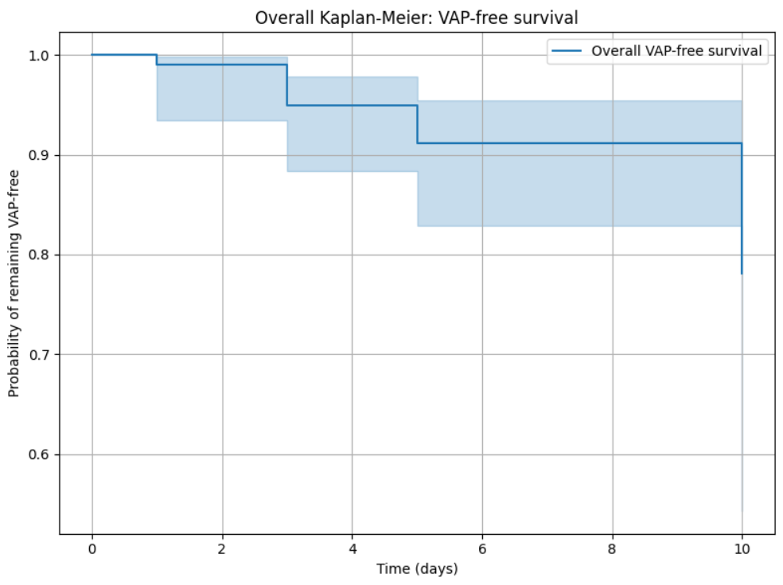
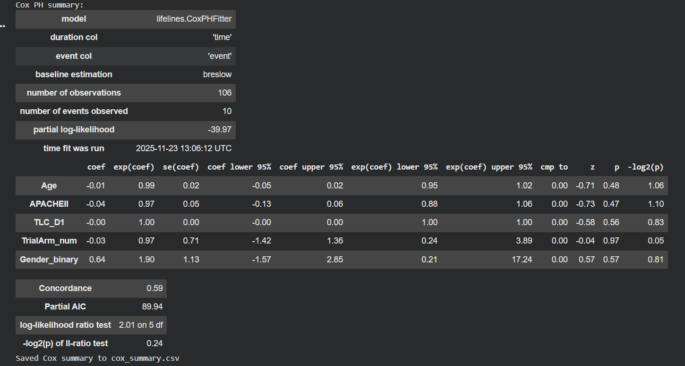
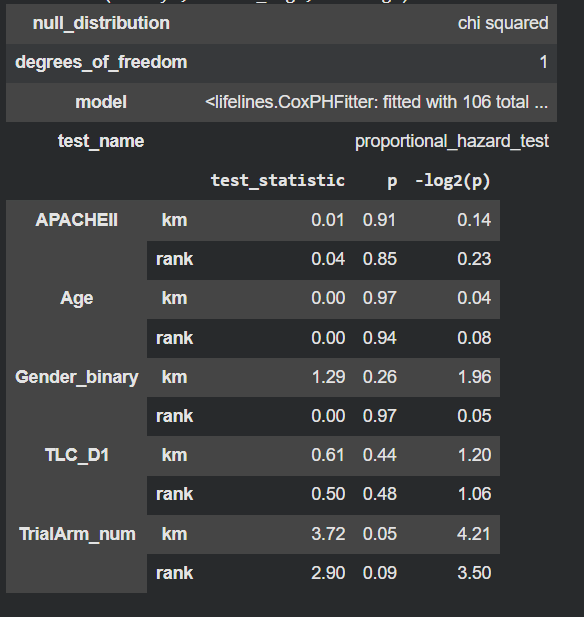

  <!-- FULL BADGE COLLECTION -->
  
  
  
  
  
  
  
  
  

# **Survival Analysis of Chlorhexidine Trial Outcomes Using Python** 🧪📈

This repository presents a structured survival analysis of data from the clinical trial  
**“Effectiveness of Oral Hygiene with Chlorhexidine Mouthwash with 0.12 percent and 0.2 percent Concentration on Incidence of VAP”**,  
published in *Annals of International Medical and Dental Research (2021)*.  
The full study is included as  
**Effectiveness of Oral Hygiene with Chlorhexidine Mouthwash.pdf**  
(`/data/Effectiveness of Oral Hygiene with Chlorhexidine Mouthwash.pdf`).

The analysis evaluates **time-to–Ventilator-Associated Pneumonia (VAP)** using established survival analysis methods, including **Kaplan–Meier estimation**, **Log-Rank test**, **Cox Proportional Hazards modelling**, and **proportional hazards diagnostics**.

---

## **1️⃣ Project Title**
**Survival Analysis of Chlorhexidine Trial Outcomes Using Python**

---

## **2️⃣ Project Summary** ✍️

This project applies survival analysis to compare **0.12% vs 0.20% chlorhexidine** mouthwash in mechanically ventilated ICU patients.  
The primary endpoint is **time to VAP**, with censoring for discharge, death, or LAMA.

Survival analysis is appropriate due to variability in follow-up duration and the presence of censored observations.  
The workflow incorporates:

- Kaplan–Meier survival estimation  
- Group comparison using Log-Rank test  
- Cox PH modelling  
- Schoenfeld residual–based PH assumption checks  
- Interpretation of hazard ratios in a clinical context  

---

## **3️⃣ Dataset Description** 📚

- **Study type:** Randomized Controlled Trial (RCT)  
- **Sample size:** 140 patients across two treatment arms  
- **Analysis dataset:** Cleaned data (`Raw Data from Chlorhexidine Trial.xlsx`)

### **Core Variables**

| Variable     | Description                           | Type        |
|--------------|---------------------------------------|-------------|
| Age          | Age in years                          | Continuous  |
| Gender       | Male / Female                         | Categorical |
| TrialArm_num | 1 = 0.12%, 2 = 0.20%                  | Categorical |
| APACHEII     | Severity of illness score             | Continuous  |
| TLC_D1       | Day-1 leukocyte count                 | Continuous  |
| time         | Days to VAP or censoring              | Continuous  |
| event        | 1 = VAP, 0 = no VAP                   | Binary      |

### **Data Dictionary**

  

---

## **4️⃣ Problem Statement** ❓

1. Is VAP-free survival different between 0.12% and 0.20% chlorhexidine groups?  
2. Does the higher concentration reduce the hazard of developing VAP?  
3. Which patient characteristics influence time to VAP?  
4. How do survival curves compare statistically?  
5. What insights do hazard ratios offer regarding clinical relevance?

---

## **5️⃣ Objectives** 🎯

1. Prepare and pre-process the clinical dataset  
2. Conduct exploratory data analysis  
3. Estimate survival curves  
4. Compare treatment groups using Log-Rank test  
5. Fit a Cox Proportional Hazards model  
6. Evaluate proportional hazards assumptions  
7. Present results with clear visualization  

---

## **6️⃣ Methodology** 🛠️

### **6.1 Data Preparation**
- Standardized variable names (`APACHEII`, `TLC_D1`).  
- Encoded categorical variables (`TrialArm_num`, `Gender_binary`).  
- Ensured numerical integrity for `time` and `event`.  
- Imputed missing `APACHEII` and `TLC_D1` using median values for distributional stability.  
- Final modeling variables:  
  `time`, `event`, `Age`, `APACHEII`, `TLC_D1`, `TrialArm_num`, `Gender_binary`.

---

### **6.2 Exploratory Data Analysis** 🔍

**Descriptive statistics**
- N = 106 (analysis dataset), VAP events = 10  
- Mean age ≈ 47.6 years  
- APACHEII ≈ 16.9  
- TLC Day-1 ≈ 15,216  
- Arm1 = 61 patients, Arm2 = 45  
- Mean follow-up ≈ 5.7 days  

**Distributions**
- Age: broad adult range  
- APACHEII: majority 10–20  
- TLC_D1: elevated counts typical for ICU  

**Life tables**
- Events concentrated between days 5–10  
- Slightly higher hazards in Arm 1 early in follow-up  

**Survival visualization**
- Kaplan–Meier curves plotted overall and by treatment arm  
- Used to assess group patterns prior to formal modelling  

---

### **6.3 Survival Modelling**
- Kaplan–Meier survival estimation  
- Log-Rank test for treatment comparison  
- Cox PH modelling with covariates  
- Schoenfeld residuals for PH assumption diagnostics  

---
## **7️⃣ Python Implementation Structure** 💻
.
├── data/
│ ├── Chlorhexidine Trials.xlsx
│ ├── Data_Dictionary.png
│ ├── Effectiveness of Oral Hygiene with Chlorhexidine Mouthwash.pdf
│ ├── Raw Data from Chlorhexidine Trial.xlsx
│
├── results/
│ ├── km_overall.png
│ ├── km_by_arm.png
│ ├── cox_summary.png
│ ├── cox_ph.png
│ ├── ph_age.png
│ ├── ph_apache2.png
│ ├── ph_gender.png
│ ├── ph_TLCD1.png
│ ├── ph_Trial_arm.png
│
├── Chlorhexidine_Trials.ipynb
├── LICENSE
└── README.md
## **7️⃣ Python Implementation Structure** 💻

---

## **8️⃣ Key Visualizations** 📊

- Overall and arm-specific Kaplan–Meier curves  
- Life tables  
- Schoenfeld residual diagnostic plots  
- Cox model summary (tabular + graphical)  
- Event distribution overview  

---

## **9️⃣ Results & Interpretation** 🧾

### **Kaplan–Meier Survival**

  

Overall VAP-free survival remained high throughout the 10-day observation period, with curves indicating low event incidence.

### **Treatment-Wise Survival**

  

Arm 2 (0.20%) exhibited fewer raw VAP events, but overall survival trends between groups were comparable.

### **Log-Rank Test**
- **p = 0.94**  
- No statistical evidence of differing survival distributions between treatment groups.

### **Cox Proportional Hazards Model**

  

- TrialArm HR = **0.97**, p = 0.97 (no measurable difference).  
- Other covariates (Age, APACHEII, TLC_D1, Gender) lacked significant hazard contributions.  
- Model concordance ≈ 0.59.

### **Proportional Hazards Diagnostics**

  

All variables satisfied the PH assumption with p-values > 0.05.

---

## **🔟 Discussion** 💬

Both chlorhexidine concentrations demonstrated consistently high VAP-free survival within the short follow-up period. Although the 0.20% group experienced fewer observed VAP cases, the survival timing and hazard patterns did not differ significantly between arms.

The Cox model corroborated this finding, showing hazard ratios close to unity and no significant covariate influence. PH diagnostics confirmed model suitability. These results align with existing literature indicating that chlorhexidine supports oral hygiene and reduces VAP risk, while differences between concentrations may be modest when analyzed over short follow-up intervals.

Survival modelling adds value by examining time-dependent risk and offering a nuanced interpretation of clinical outcomes beyond simple event counts.

---

## **1️⃣1️⃣ Conclusion** ✅

- Both chlorhexidine strengths maintained high VAP-free survival.  
- No statistically significant differences in time to VAP were detected between 0.12% and 0.20% concentrations.  
- Baseline variables showed no meaningful effect on hazard.  
- Survival analysis provided structured, interpretable insights relevant for clinical evaluation.

---

## **1️⃣2️⃣ Future Work** 🔭

- Incorporation of time-varying covariates (e.g., daily inflammatory markers)  
- Exploration of parametric survival models  
- Application of machine-learning survival methods  
- Validation using external ICU datasets  
- Competing-risk analysis with mortality endpoints  

---

### **Citation**
Vyas N, Mathur P, Jhawar S, Prabhune A, Vimal P. (2021).  
*Effectiveness of Oral Hygiene with Chlorhexidine Mouthwash…*  
Annals of International Medical and Dental Research.

---

**End of README**

