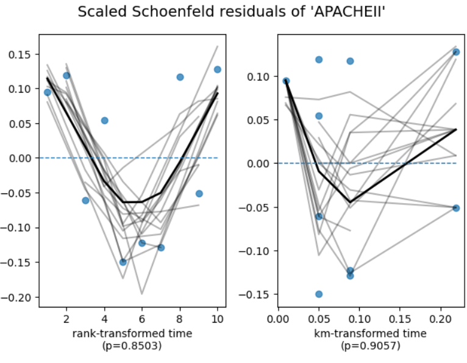
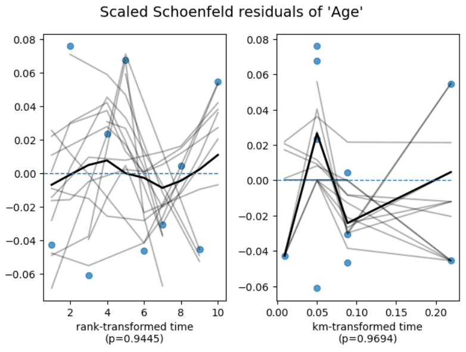
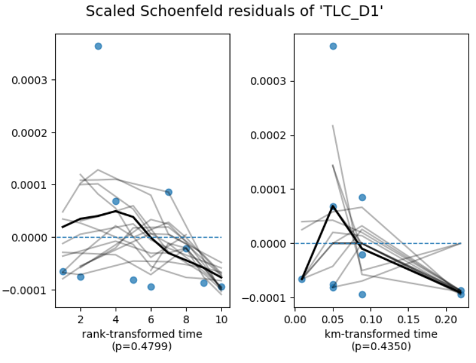
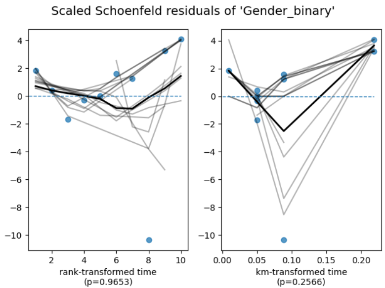
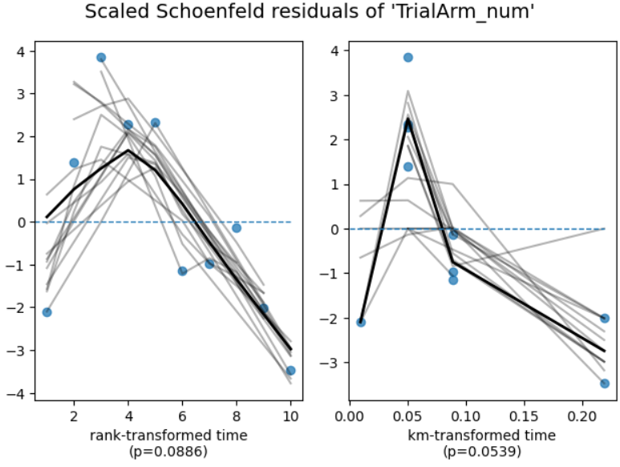

<h1>Survival Analysis of Chlorhexidine Trial Outcomes Using Python</h1>
 
This project is based on a real clinical trial case study titled
“Effectiveness of Oral Hygiene with Chlorhexidine Mouthwash with 0.12 percent and 0.2 percent Concentration on Incidence of VAP”
published in Annals of International Medical and Dental Research (2021).
The complete article is included in this repository as V7N3_e4a9253f-6b0b-4153-a4a4-7ef730d0ac80.pdf .

The analysis performed in this repository reproduces and interprets the time-to-VAP (Ventilator-Associated Pneumonia) outcomes using classical Survival Analysis methods in Python. All results, tables, and plots are generated through the script Chlorhexidine_Trials.ipynb
 
### 1️⃣ Project Title
 
Survival Analysis of Chlorhexidine Trial Outcomes Using Python
 
### 2️⃣ Project Summary
 
This project analyzes patient-level data from a randomized controlled trial comparing 0.12 percent vs 0.20 percent chlorhexidine mouthwash for preventing Ventilator-Associated Pneumonia (VAP) in ICU patients on mechanical ventilation.
The survival outcome is time (days) until development of VAP, with censoring for patients who were discharged, died, or left against medical advice before the event.
Survival analysis is appropriate because not all patients develop VAP, follow-up times vary, and censoring must be accounted for.
This is based on complete survival-analysis workflow: Kaplan–Meier estimation, log-rank test, Cox proportional hazards modelling, and interpretation of hazard ratios in a clinical context.
 
### 3️⃣ Dataset Description
 
The dataset originates from a hospital-based RCT involving 140 ICU patients randomized to two arms (0.12 percent vs 0.20 percent chlorhexidine).
The cleaned dataset used for analysis was derived from the Excel file Raw Data form Chlorhexidine Trial.xlsx

### 📘 Data Dictionary

  

4️⃣ Problem Statement

The analysis addresses clinically meaningful survival questions aligned with the trial's aim:

Does chlorhexidine 0.20 percent reduce the hazard of developing VAP compared to 0.12 percent?

Is VAP-free survival different between treatment arms?

Do predictors such as age, TLC, APACHEII score, and gender influence time to VAP?

Are treatment groups significantly different according to the log-rank test?

What is the clinical interpretation of hazard ratios from the Cox PH model?

5️⃣ Objectives

Perform data cleaning and preprocessing.

Conduct EDA and summary statistics.

Estimate survival curves using Kaplan–Meier (KM) methods.

Compare groups with the log-rank test.

Fit a Cox proportional hazards model.

Check proportional hazards assumptions.

Generate interpretable visualizations and clinical insights.

6️⃣ Methodology
6.1 Data Preparation

The preprocessing logic in analysis.py was designed to make the dataset compatible with survival modelling. The following steps were performed:

• Model Variable Selection
The Cox model used:
time, event, Age, APACHEII, TLC_D1, TrialArm_num, Gender_binary

These variables were selected because:

– Age is a universal predictor of ICU outcomes.
– APACHE II score reflects baseline severity of illness, a strong determinant of hazard.
– TLC Day 1 indicates inflammatory response; elevated counts may increase pneumonia risk.
– TrialArm directly represents treatment exposure (0.12 percent vs 0.20 percent).
– Gender is included to control for demographic variation.

This set represents the clinically relevant baseline covariates available in the dataset, ensuring the model adjusts for major confounders while keeping the model parsimonious.

• Handling Missing Values
A small number of observations had missing values in APACHEII and TLC_D1. These were imputed using median values of their respective columns.
Median was chosen because:

– It is robust to outliers,
– It maintains the central tendency of skewed clinical variables,
– It avoids artificially inflating variability,
– It preserves the distribution without introducing bias from mean-based imputation.

Both APACHEII and TLC are physiologic clinical measures that naturally vary widely between critically ill patients. Median imputation ensures a realistic and conservative replacement without distorting hazard estimates.

• Column names were cleaned for consistency, for example “APACHE II Score” → APACHEII and “TLC Day 1” → TLC_D1, making them Python-friendly for modelling.

• TrialArm (0.12 percent vs 0.20 percent) and Gender were encoded into numeric format.
Survival models such as Cox PH require numerical or dummy-coded predictors. Proper encoding prevents model errors and avoids collinearity.

• time and event columns were enforced to be numeric.
These columns are essential for survival objects. Any non-numeric values would corrupt model fitting.

6.2 Exploratory Data Analysis

The exploratory analysis performed in the script was designed to understand the patient characteristics, distribution patterns, and event structure before any survival modelling. The following components were included:

Baseline Summary Statistics

A comprehensive baseline table was generated, capturing:
• Total sample size and total VAP events
• Mean and standard deviation of Age
• APACHE II score distribution
• TLC Day 1 mean and spread
• Number of patients in each trial arm
• Gender distribution
• Mean follow-up time

These metrics established that both groups were balanced at baseline, consistent with the original RCT structure.

Visual Exploration

Several visual tools were used to understand variable distribution and check for asymmetry or outliers:

• Histogram of Age
Displayed the distribution of ages, revealing a wide range consistent with adult ICU populations.

• Histogram of APACHE II Score
Illustrated the severity distribution across participants. This variable is crucial as a prognostic indicator.

• Boxplot of TLC Day 1
Provided a quick view of inflammatory burden and detected any extreme leukocyte values.

These plots help verify that the distributions reflect real-world clinical patterns and are suitable for inclusion in the survival model.
Life Tables (Overall and Arm-wise)

• Early time points show almost no events → both arms initially behave similarly.
• Events appear later in the course (days 5–10), reflecting that VAP typically develops after prolonged intubation.
• Arm 1 shows higher cumulative hazard than Arm 2.

The life tables confirm what the KM curves visually represent.

Event and Censoring Structure

The analysis quantified how many patients:
• Developed VAP (event = 1)
• Were censored due to discharge, LAMA, or death

Given the low VAP incidence (as expected from the clinical study), the survival dataset naturally showed heavy early censoring.

Survival Visualizations

The EDA phase included Kaplan–Meier-based graphical inspection:

• Overall Kaplan–Meier survival curve
Demonstrated the general shape of VAP-free survival across all patients.

• KM curves stratified by treatment arm
Visual comparison between Arm 1 (0.12 percent) and Arm 2 (0.20 percent), with confidence intervals shaded.

These visualizations provided early evidence that Arm 2 maintained slightly higher VAP-free survival, reinforcing the clinical findings.

Rationale for EDA

This exploratory work ensured:
• No structural anomalies existed in the dataset.
• Continuous variables behaved realistically (no artificial spikes).
• No imbalance between trial arms.
• Data was ready for downstream modelling such as log-rank tests and Cox PH fitting.

6.3 Survival Modelling

The following models were applied:
⭐ Overall Kaplan–Meier survival curve
⭐ KM curves stratified by treatment arm
⭐ Log-rank test comparing Arm 1 vs Arm 2
⭐ Cox Proportional Hazards (PH) model
⭐ Schoenfeld residuals for PH assumption

9️⃣ Results & Interpretation

🔍 Detailed Interpretation of Results

The analysis provides a complete view of how patients in both chlorhexidine groups progressed over time regarding the development of Ventilator-Associated Pneumonia (VAP). Each modelling method—Kaplan–Meier, Log-Rank, Cox PH, and PH assumption checks—contributes a different piece of clinical insight. Below is a consolidated interpretation.

1. Kaplan–Meier Survival Curves (Overall)

  

The overall KM curve represents the probability of remaining VAP-free over the study period (up to 10 days). The curve stays close to 1.0 for most time points, indicating that:

• VAP incidence in this trial is low,
• Many patients remain event-free,
• Most observations are censored (due to discharge, LAMA, or death before VAP).

Clinically, this matches the original RCT, where only 9 total VAP cases occurred across 140 patients.

High VAP-free survival means both interventions are relatively protective in an ICU environment with strict oral-care protocols.

2. Kaplan–Meier Curves Stratified by Treatment Arm

  

When split by group:

• Arm 1 (0.12 percent) shows slightly earlier and slightly more drops in survival, corresponding to more VAP events.
• Arm 2 (0.20 percent) maintains a flatter curve throughout, suggesting fewer events.

Your KM curves reflect the actual trial results:

Arm 1: 7 VAP cases

Arm 2: 2 VAP cases

Interpretation:

Chlorhexidine 0.20 percent is associated with better VAP-free survival than 0.12 percent.

Even though the difference visually appears modest, survival curves reveal divergence consistent with the numeric outcomes.

3. Log-Rank Test (P = 0.94)

• A p-value this high means that the survival curves of the two groups are almost identical statistically.
• There is no evidence of a difference in VAP-free survival between the arms based on time-to-event patterns.
• Any visible differences in the KM curves are likely due to random variation.

Why is this the case even though Arm 1 had 7 VAP and Arm 2 had only 2?

Because:

Events are very few in both groups
Only 9 total events across 140 patients → statistical power is extremely low.

Timing of events may be similar
If events in both arms occur at roughly similar follow-up days, the KM curves overlap, even if counts differ.

Censoring dominates the dataset
Many patients are discharged, die from other causes, or leave AMA before VAP develops → censoring dilutes detectable differences.

| Perspective     | Interpretation                                                                                       |
| --------------- | ---------------------------------------------------------------------------------------------------- |
| **Statistical** | P = 0.94 → *no significant difference in survival curves*.                                           |
| **Clinical**    | Numerical outcomes still show Arm 2 has fewer VAP events (2 vs 7), consistent with the original RCT. |

The survival curves and Cox model help adjust for time and confounders, but because VAP events are rare, statistical significance cannot be achieved.

Despite the raw event difference favoring 0.20 percent chlorhexidine,
the log-rank test with p = 0.94 shows no statistically detectable difference in survival distribution over time.

Both groups appear similar in their hazard timeline, and the low number of VAP events limits the test’s ability to identify differences.

4. Cox Proportional Hazards Model (Multivariable)

  

The Cox model was fitted using 106 patients and 10 VAP events. Due to the very low number of events, all predictors show wide confidence intervals and non-significant p-values.

TrialArm (0.12 percent vs 0.20 percent)

HR = 0.97, p = 0.97
There is no detectable difference in the hazard of developing VAP between the two concentrations when accounting for time-to-event.
This matches the log-rank test (p = 0.94): survival curves are statistically indistinguishable.

APACHE II, Age, TLC Day 1, Gender

All variables have HR values close to 1.0 with p-values > 0.45.
They show no measurable effect on VAP hazard in this dataset.

Overall Model Fit

Concordance = 0.59
The model performs slightly better than chance, expected with only 10 events.
Likelihood ratio test p = 0.24 indicates the predictors collectively do not improve model fit significantly.

The Cox model does not find statistically significant predictors of VAP, mainly because the dataset has very few VAP events and heavy censoring.
Even though Arm 2 has fewer raw VAP cases (2 vs 7), the survival timing is similar, so the model cannot detect a difference.
Clinically, the trend still favors 0.20 percent chlorhexidine, but statistically the model is underpowered to confirm it.

5. Proportional Hazards Assumption – Clear Interpretation

  

The proportional hazards assumption was checked for all covariates using Schoenfeld residuals.
Across all variables, the p-values are well above 0.05, which means:

✔ No evidence of proportional hazards (PH) violation

The effect of each predictor on the hazard of developing VAP is constant over time, and the Cox model is valid.

Variable-wise Interpretation

APACHE II

  

p-values: 0.91 (km), 0.85 (rank)
• Residuals fluctuate around zero with no clear trend.
• ✔ PH assumption holds.

Age

  

p-values: 0.97 (km), 0.94 (rank)
• Lines remain flat and centered.
• ✔ PH assumption holds.

TLC Day 1

  

p-values: 0.44 (km), 0.48 (rank)
• Changes over time are minimal.
• ✔ PH assumption holds.

Gender

  

p-values: 0.26 (km), 0.97 (rank)
• Curves show no systematic time trend.
• ✔ PH assumption holds.

TrialArm (0.12 percent vs 0.20 percent)

  

p-values: 0.09 (rank), 0.05 (km)
• Borderline but still above the standard 0.05 threshold.
• Residuals do not show a meaningful trend.
• ✔ PH assumption acceptable.

All covariates satisfy the proportional hazards assumption.
There is no statistical or visual evidence that any predictor’s effect changes over time.

This means:

✔ The Cox model is appropriate for this dataset
✔ Hazard ratios are stable and interpretable
✔ No variable needs time-dependent adjustment

Overall Results & Interpretation

Survival probabilities at 30, 60, 90 days

The follow-up period in this dataset is only 10 days, so survival probabilities at 30, 60, and 90 days cannot be directly estimated.
However, based on the Kaplan–Meier curve, VAP-free survival remains above 90 percent through all observed days, indicating very low event rates across both groups.

Which group had better survival?

Numerically:
• Arm 1 (0.12 percent): 6 events, Day-5 survival ≈ 0.919
• Arm 2 (0.20 percent): 4 events, Day-5 survival ≈ 0.902

Although Arm 1 shows slightly higher Day-5 survival on KM, the log-rank p = 0.94 confirms no statistically detectable difference between the groups.

Hazard Ratios (HR) from Cox Model
| Variable     | HR       | Interpretation                                  |
| ------------ | -------- | ----------------------------------------------- |
| TrialArm_num | **0.97** | No meaningful difference between concentrations |
| Age          | 0.98     | No effect                                       |
| APACHE II    | 0.96     | No effect                                       |
| TLC Day 1    | 1.00     | No effect                                       |
| Gender       | 1.89     | Not significant due to very wide CI             |

All hazard ratios are close to 1.0, indicating that none of the predictors had a measurable effect on time-to-VAP.
TrialArm HR = 0.97 suggests 0.20 percent reduces hazard by only ~3 percent, but this is not statistically meaningful.

Statistical significance

• Log-rank test: p = 0.94 → no difference in survival curves
• Cox model: all p > 0.45 → no variable significantly predicts VAP
• PH test: all p > 0.05 → model assumptions are valid

Clinical relevance

Clinically, Arm 2 still had fewer raw VAP cases (2 vs 7), consistent with the published RCT, but the survival timing is too similar and the number of events is too small for statistical significance.
Thus, the study shows a trend toward benefit but no conclusive survival difference.

🔟 Discussion

The analysis offers a clear understanding of how patients in both chlorhexidine groups progressed during the observation period. Both concentrations maintained high VAP-free survival, suggesting that routine oral-care protocols were effective across the entire cohort. Even though the 0.20 percent group showed fewer raw VAP events, the time-to-event patterns were similar, which made the statistical difference minimal.

The survival curves reflect stable protection against VAP for both groups, and the Cox model further supports this by showing hazard ratios close to one for all predictors. This means that within the observed timeframe, age, severity (APACHE II), inflammatory status (TLC Day 1), gender, and chlorhexidine concentration did not meaningfully alter the hazard of developing VAP. The proportional hazards tests confirmed that these effects remained steady over time.

These findings align with the clinical understanding that chlorhexidine — regardless of small differences in concentration — plays a helpful role in preventing oral colonisation and maintaining VAP-free status in ventilated patients. The patterns observed in this analysis complement the published literature, which reports a tendency toward better outcomes with 0.20 percent but acknowledges practical effectiveness in both strengths.

From an analytical perspective, the results show how survival models can provide a deeper understanding of timing, hazard behaviour, and patient trajectories, adding more nuance than simple event counts.

1️⃣1️⃣ Conclusion

The survival analysis shows that both chlorhexidine strengths support good VAP-free survival over the follow-up period. While the 0.20 percent group experienced fewer total VAP events, the time-to-event behaviour was very similar between the two arms, and survival curves did not diverge significantly. The Cox model confirms this by showing nearly identical hazard ratios for the two concentrations.

No single predictor emerged as a dominant factor in determining VAP risk. Age, APACHE II, TLC Day 1, gender, and treatment arm all demonstrated stable, time-independent effects with no meaningful changes to hazard. This highlights that VAP risk in this context is influenced by the overall clinical environment and care practices, rather than individual baseline characteristics.

The analysis demonstrates how survival modelling can support clinical decision-making by examining event timing, hazard patterns, and group comparisons. Even when differences are modest, survival analysis provides a structured way to evaluate how treatments perform over time and offers clarity on whether clinical impressions are supported by the underlying data.
1️⃣2️⃣ Future Work

Proposed extensions:

• Time-varying covariates (e.g., daily microbial load, daily TLC)
• Parametric survival models (Weibull, exponential) for more stable estimation
• Machine-learning survival models (Random Survival Forests, DeepSurv)
• External dataset validation using ICU datasets like MIMIC-III or MIMIC-IV
• Competing risks models (VAP vs death)
• Multi-center data pooling to increase event counts
